实验一:计算机视觉库的安装

一、实验目的

掌握 Anaconda 的安装与基本操作,熟悉GPU 使用环境的配置及对应版本 PyTorch 的安
装,并完成 OpenCV 的安装与配置

二、实验内容

1、Anaconda的安装及配置
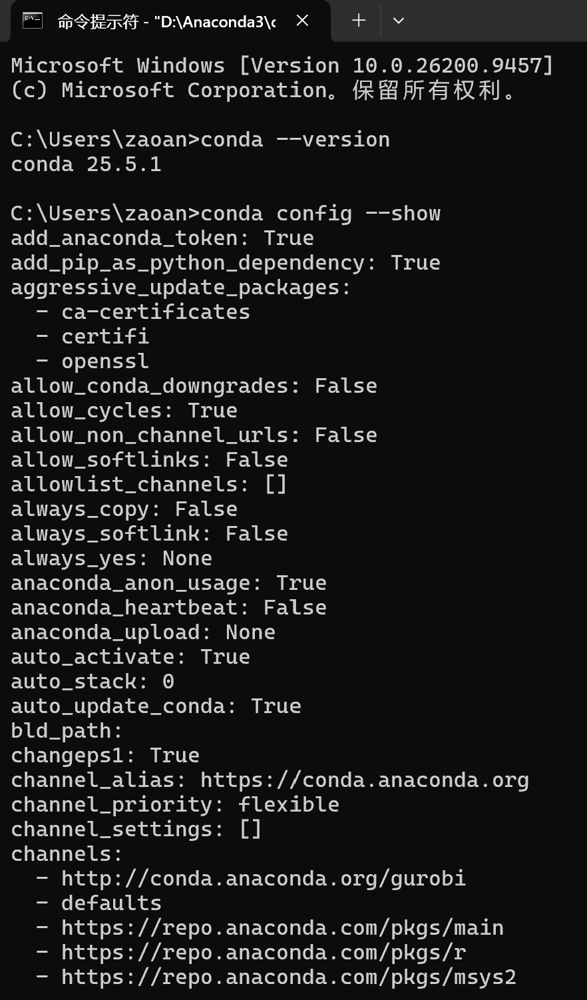
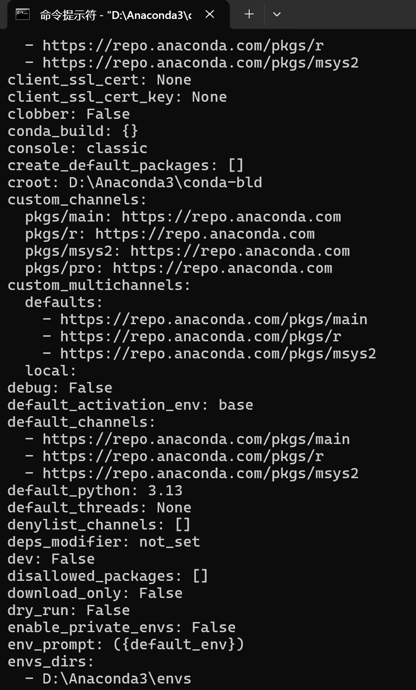
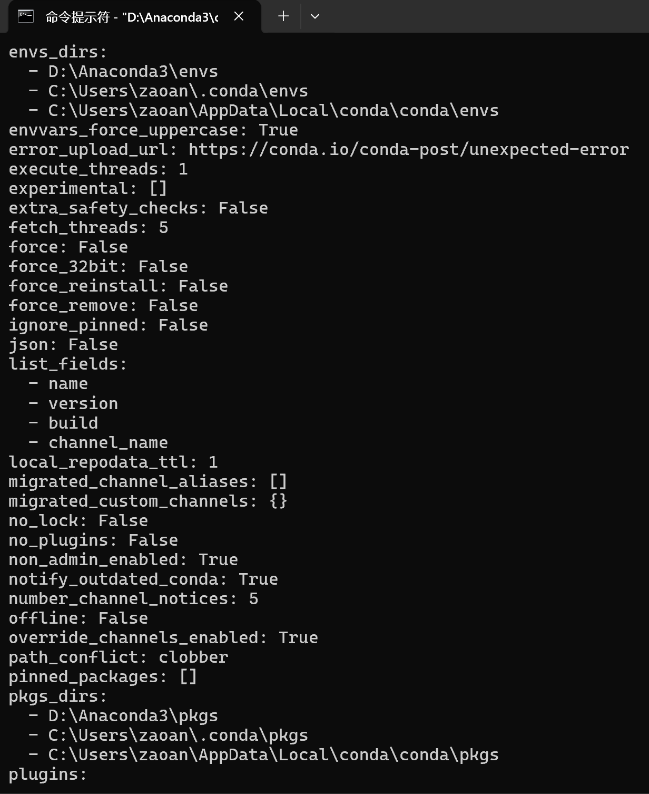
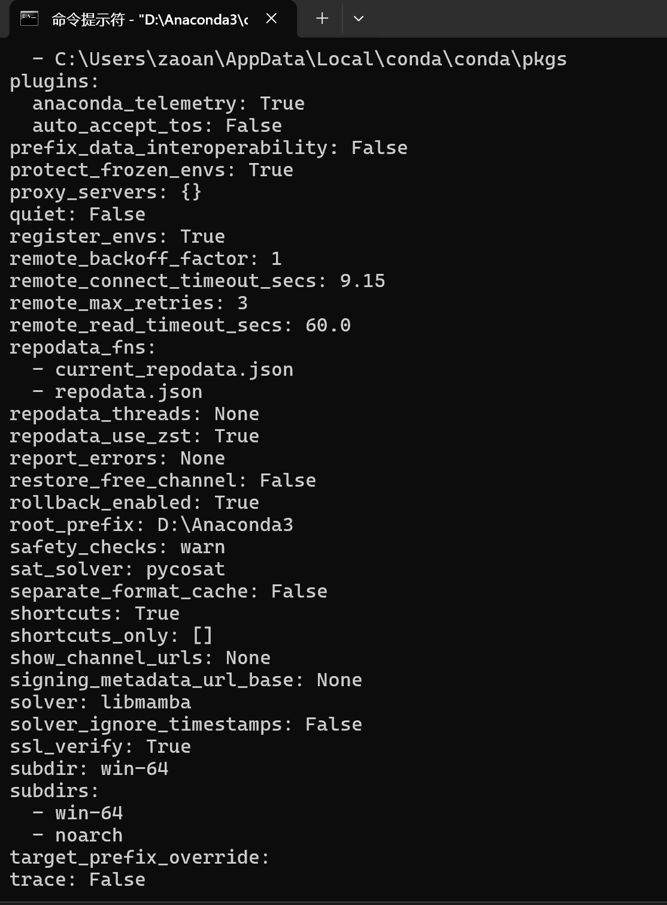
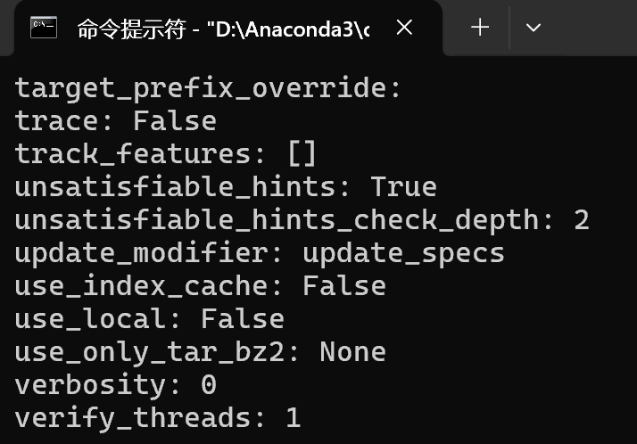
如上图，已经安装过anaconda，现在查找version和配置

2、创建一个虚拟环境，alice_env_0924:
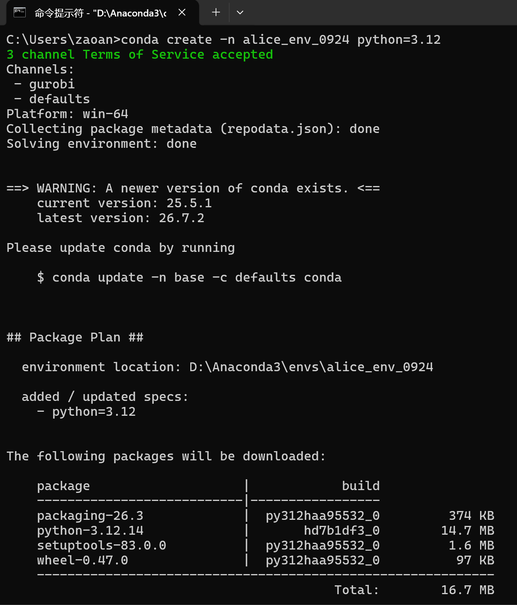
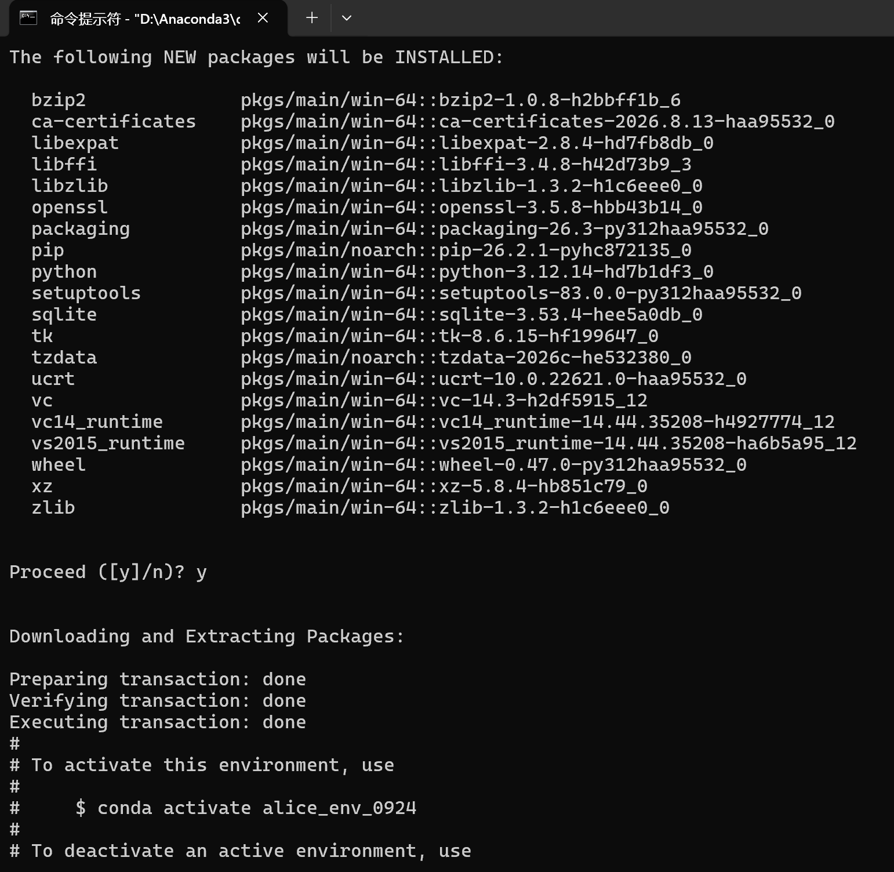
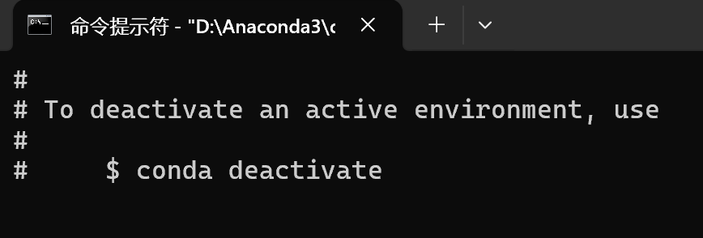

3、现在进入环境，并安装torch和torchvision
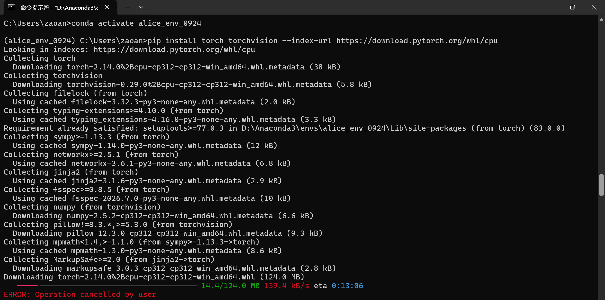

4、由于上面的链接安装的太慢了，现在换一个安装源安装
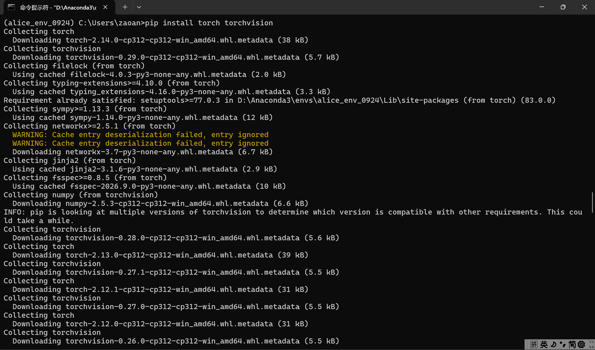
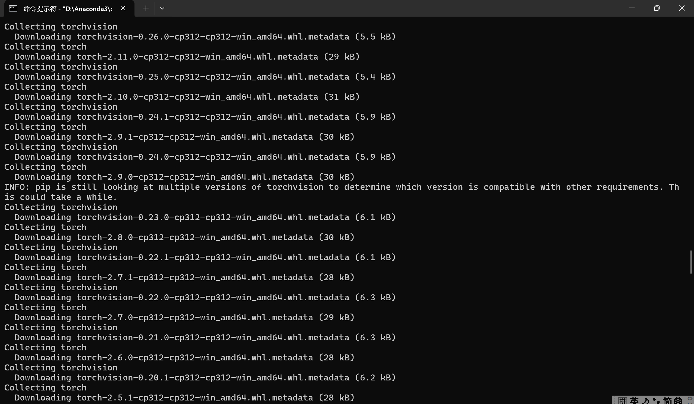
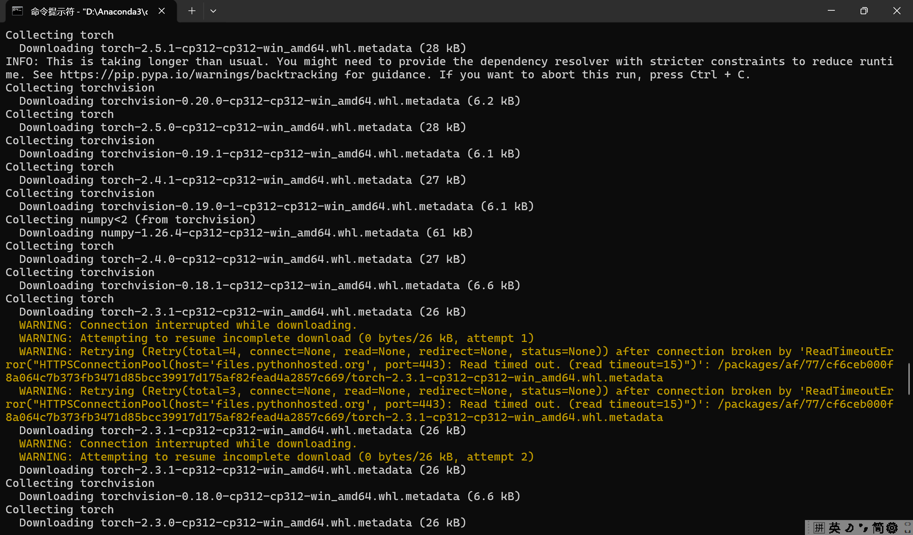
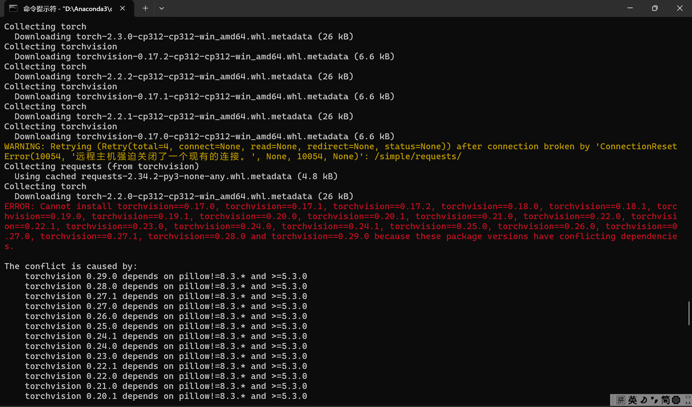
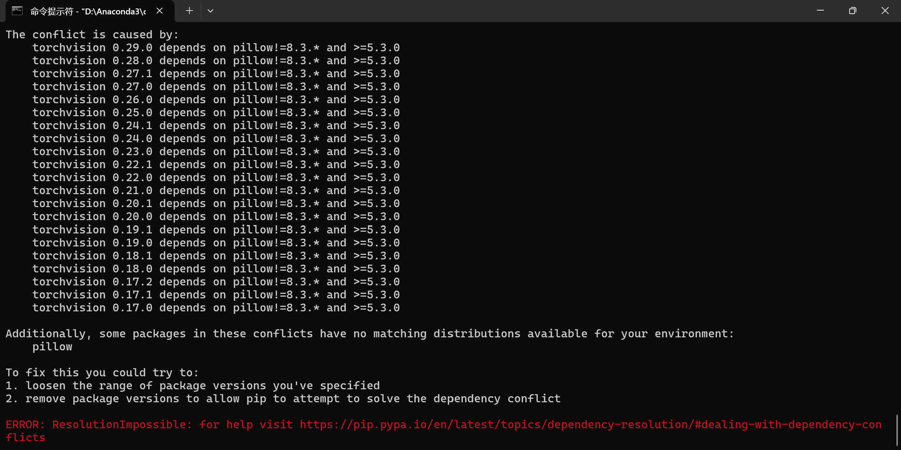

5、从上图可知，当前的 Python 3.13 环境与 torchvision 所需的 Pillow 版本之间存在兼容性问题。核心原因是 Pillow 从 11.0 版本才开始支持 Python 3.13，而 pip 在尝试安装 torchvision 时，错误地选择了依赖旧版 Pillow 的版本，导致找不到匹配的包。

如下是我的解决方案：
单独安装兼容的 Pillow
先手动安装一个明确支持 Python 3.13 的 Pillow 版本，再安装 PyTorch。这能绕过 pip 的依赖解析冲突。

确保在 alice_env_0924 环境中。

升级 pip 和构建工具：
python -m pip install --upgrade pip setuptools wheel

单独安装 Pillow 11 或更高版本：
pip install Pillow>=11.0.0 -i https://pypi.tuna.tsinghua.edu.cn/simple

然后安装 CPU 版 PyTorch：
pip install torch torchvision --index-url https://download.pytorch.org/whl/cpu
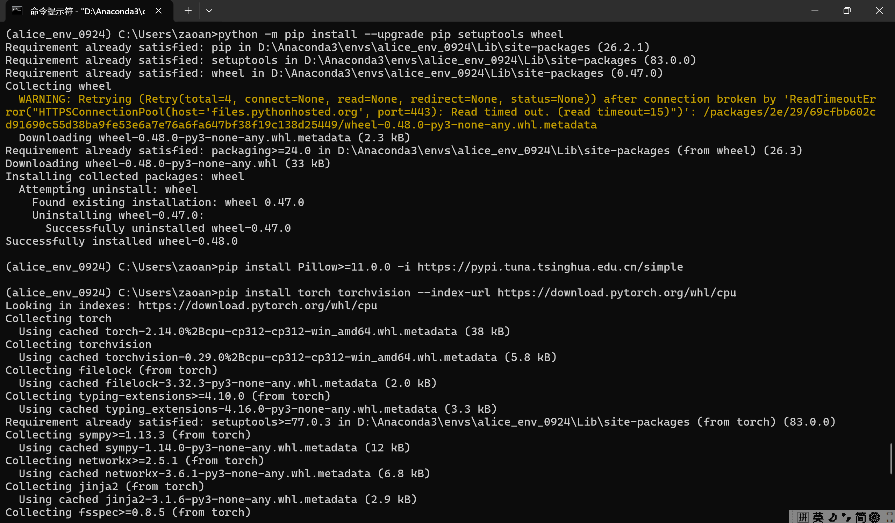
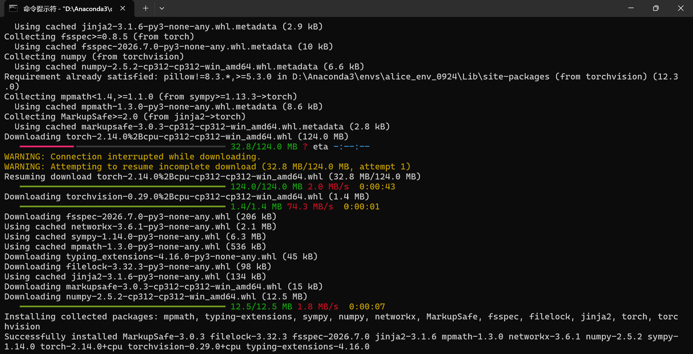

6、如图，看到successfully，安装成功
现在查看torch和torchvision的版本号：
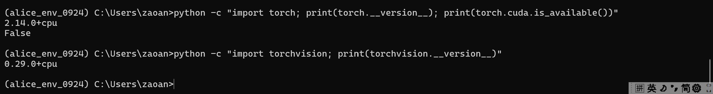

7、现在创建GitHub仓库并推送上去：
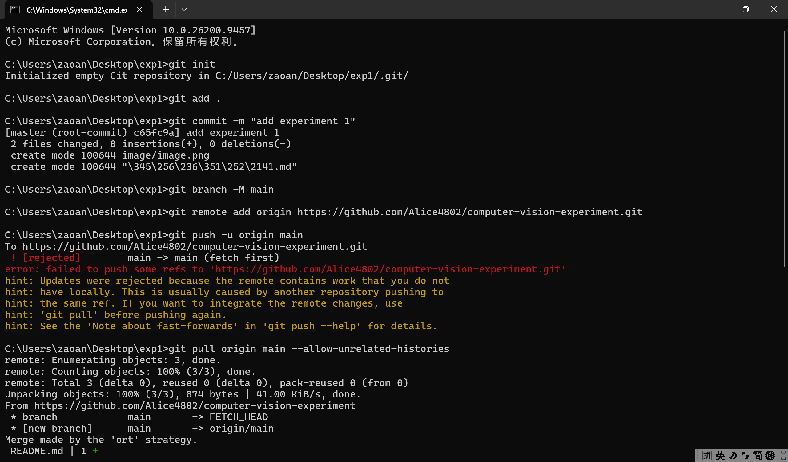

说明：图中有个error是因为GitHub 远程仓库里已经有东西了（很可能是创建仓库时自动生成的 README.md），而本地是全新的仓库，两边历史不相干，所以不能直接 push。

第一步：拉取远程内容并允许合并无关历史
git pull origin main --allow-unrelated-histories
Vim 里按 Esc，输入 :wq，回车。

:wq 回车后，命令行会显示 merge 完成，然后执行：
git push -u origin main