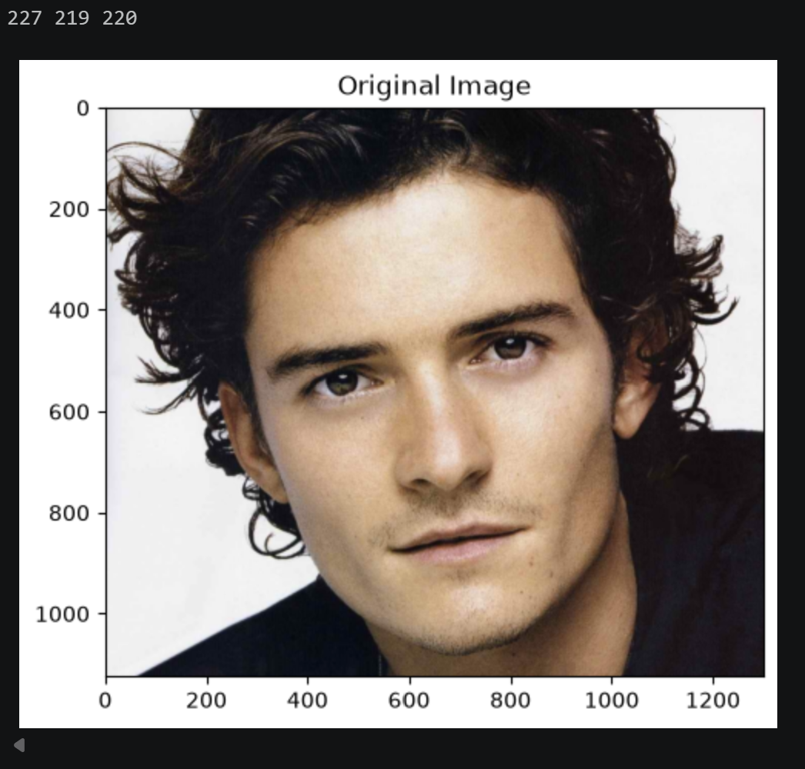
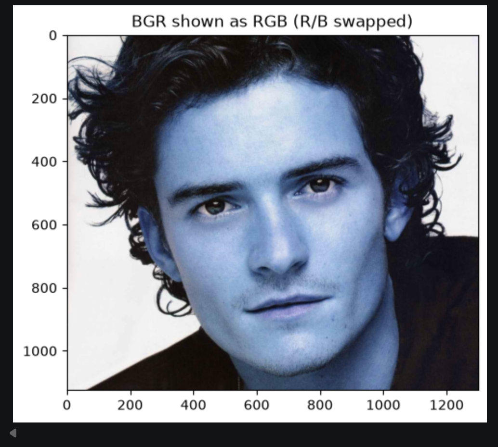
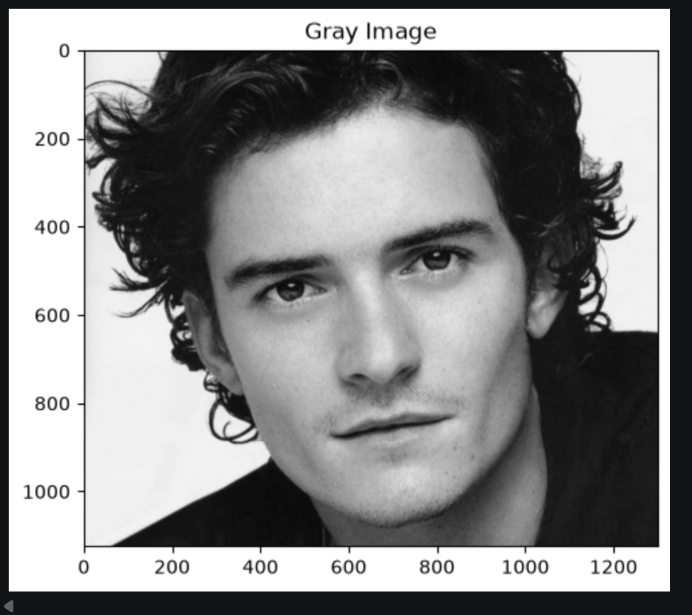
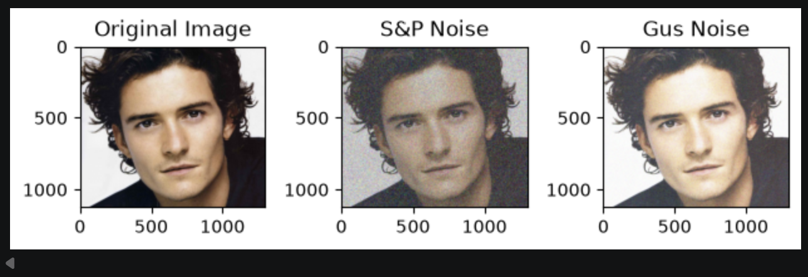
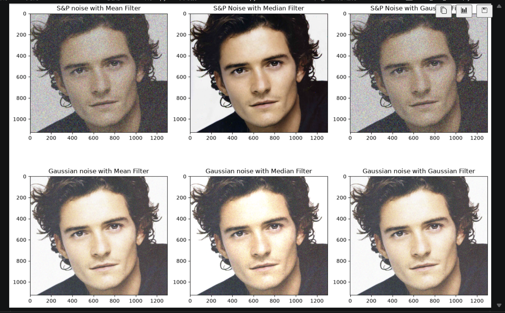
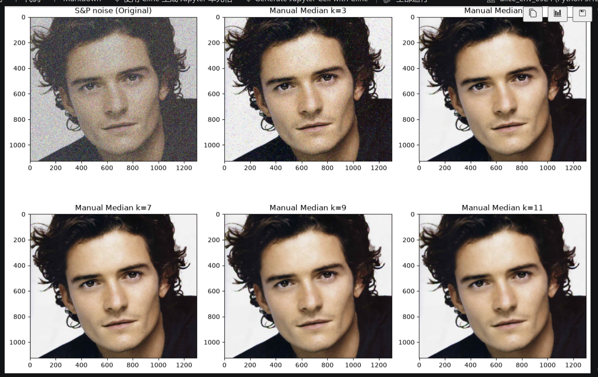
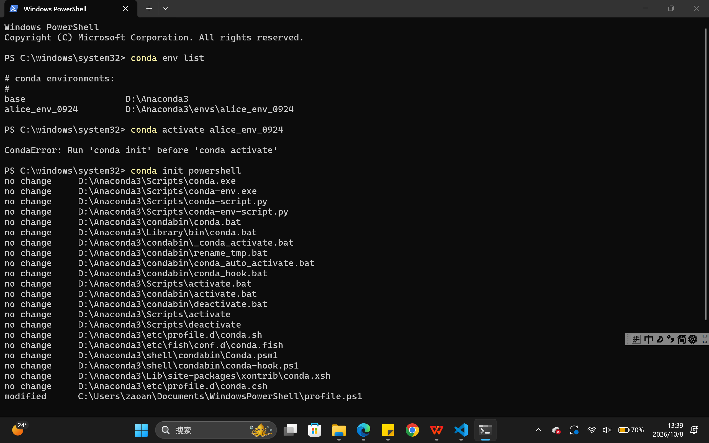
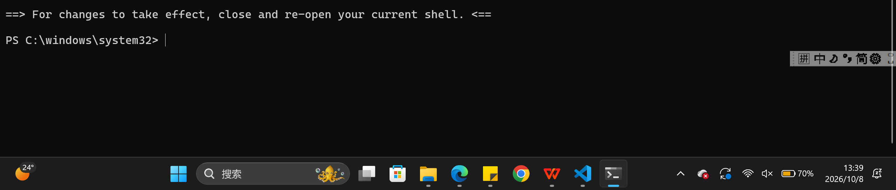
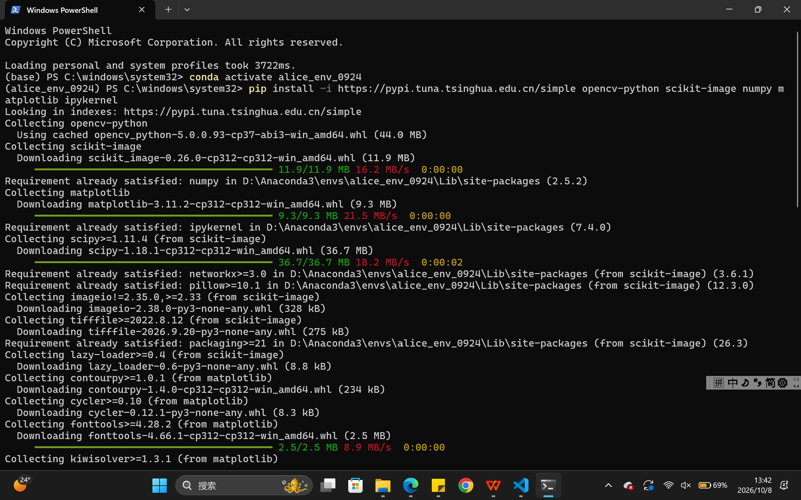
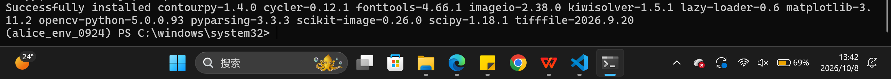

# 实验⼆：图像增强参考⽂档

## ⼀、实验⽬的
学会OpenCV的基本使⽤⽅法，利⽤OpenCV等计算机库对图像进⾏平滑、滤波等操作，实现图像增强。

## ⼆、实验内容
### 2.1 导⼊图像滤波相关的依赖包
1.OpenCV库：计算机视觉与图像处理
2.scikit-image库：图像增强与分析，random_noise ⽤于给图像添加噪声
3.NumPy库：科学计算的基础库
4.Matplotlib库：绘图与数据可视化
5.pathlib库：操作文件和目录路径，把路径当成对象来处理

```text
# =====================导⼊依赖库=====================
import cv2
from skimage.util import random_noise
import numpy as np
from matplotlib import pyplot as plt
from pathlib import Path
```

### 2.2 读取原始图像并进⾏⾊彩空间转换
读取计算机本地图像⽂件，获取并输⼊[100，100]处像素点的RBG参数并输出,通过下⾯的输出结果可以看到，[100,100]像素点的RGB为[227 219 220]，表现为白⾊，通过图像也可以看到这个像素点属于背景板，白色。

代码块：
```text
# ====================读取原始图像=====================
# 这里为了方便管理，把所有path都写在一块了
img_path = Path(r"C:\Users\zaoan\Desktop\CVexp\image\exp2_train.png") # 原始图像路径
save_path = Path(r"C:\Users\zaoan\Desktop\CVexp\image\exp2_original.jpg") # 保存原始图像
cvt_path = Path(r"C:\Users\zaoan\Desktop\CVexp\image\exp2_cvtrb.jpg") # 保存r，b翻转图像
gray_path = Path(r"C:\Users\zaoan\Desktop\CVexp\image\exp2_gray.jpg") # 保存灰度图
noise_comparison_path = Path(r"C:\Users\zaoan\Desktop\CVexp\image\exp2_noise_comparison.jpg") # 保存椒盐噪声、高斯噪声对比图像
filter_results_2x3_path = Path(r"C:\Users\zaoan\Desktop\CVexp\image\exp2_filter_results_2x3.jpg") # 保存不同噪声下不同滤波的图像
manual_median_path = Path(r"C:\Users\zaoan\Desktop\CVexp\image\exp2_manual_median.jpg") # 保存中值滤波下不同keranl大小的对比图像

# 获取原始图像
img = cv2.imread(str(img_path))

# 获取图像中[100，100]这个像素的rbg三⾊
(b, g, r) = img[100, 100]

# 打印这个像素点的rbg参数
print(b, g, r)

# OpenCV 读入是 BGR，matplotlib 显示要转成 RGB
img_rgb = cv2.cvtColor(img, cv2.COLOR_BGR2RGB)

plt.imshow(img_rgb)
plt.title('Original Image')
plt.savefig(str(save_path), dpi=300)
plt.show()
```

结果：


由于原始图像就是BGR格式，所以直接输出就得到了蓝⾊和红⾊互换的颜⾊反转。相当于R和B通道互换

代码块：
```text
# 颜⾊空间转换，将原始图像BGR格式 转换成 RGB格式，蓝⾊和红⾊互换
# img 是 BGR，本次实验直接输出就行，上面的实验里matplotlib 当 RGB 显示 → 红蓝对调
plt.imshow(img)
plt.title('BGR shown as RGB (R/B swapped)')
plt.savefig(str(cvt_path), dpi=300)
plt.show()
```

结果：


cv2.COLOR_BGR2GRAY是将原始图像的RBG格式转换为灰度图，将三维的RGB通道映射为⼀维的灰度通道

代码块：
```text
# 将原始图像的RBG格式转换为灰度图
gray_img = cv2.cvtColor(img, cv2.COLOR_BGR2GRAY)

plt.imshow(gray_img, cmap='gray')
plt.title('Gray Image')
plt.savefig(str(gray_path), dpi=300)
plt.show()
```

结果：


### 2.3 添加噪声
这⾥在原始图像的基础上添加噪声，引⼊了两个API⽅法，椒盐噪声和⾼斯噪声，通过对⽐可以发现，椒盐噪声和⾼斯噪声的本质不同，椒盐噪声表现为在灰度通道中，像素会随机替换为⽩⾊或者⿊⾊像素；在RGB通道表现为像素变成随机彩⾊点。⽽⾼斯噪声会在每个像素上添加随机偏差，服从⾼斯分布
椒盐噪声产生的原因有：传感器突然受到强烈干扰，使传感器中模数转换器发生错误。
高斯噪声产生的原因有：拍摄时亮度不够，图像传感器中电路各元器件自身的噪声和互相影响，或图像传感器长期工作温度过高等。

代码块：
```text
# ==========================添加噪声=========================
# mode='s&p'代表椒盐噪声，s代表⽩⾊，p代表⿊⾊，amount=0.4代表会有40%的像素
sp_noise_img = random_noise(img_rgb, mode='s&p', amount=0.4)
# mode='gaussian' 代表⾼斯噪声，会在每个像素上添加随机偏差，服从⾼斯分布（均值
gus_noise_img = random_noise(img_rgb, mode='gaussian', mean=0.2, var=0.03)
# 原图
plt.subplot(1, 3, 1)
plt.imshow(img_rgb, cmap='gray')
plt.title('Original Image')
# 椒盐噪声
plt.subplot(1, 3, 2)
plt.imshow(sp_noise_img, cmap='gray')
plt.title('S&P Noise')
# ⾼斯噪声
plt.subplot(1, 3, 3)
plt.imshow(gus_noise_img, cmap='gray')
plt.title('Gus Noise')
plt.tight_layout()
plt.savefig(str(noise_comparison_path), dpi=300)
plt.show()
```

结果：


### 2.4 图像滤波
将图像认为产⽣噪声后，⽤OpenCV的三个API滤波⽅式进⾏对⽐，分别对椒盐滤波和⾼斯滤波使⽤【均值滤波】，【中值滤波】，【⾼斯滤波】，对⽐每个最适合的滤波⽅式。
均值滤波（Mean Filter）：对⾼斯噪声的去除效果较好，能够平滑整幅图像，但对椒盐噪声中的尖锐⿊⽩点去除不彻底，且容易造成边缘模糊。会产生块状效应
中值滤波（cv2.medianBlur）：对椒盐噪声的去除效果显著，能有效保留图像边缘和细节；对⾼斯噪声也有⼀定的抑制作⽤，但整体去噪效果略逊于均值滤波。中值滤波的具体介绍见下。
⾼斯滤波（cv2.GaussianBlur）：对⾼斯噪声的去除效果最佳，平滑⾃然，且保留了⼀定边缘信息；但对椒盐噪声的处理能⼒有限，因为其噪声是突变的⽽⾮连续分布。具体公式见P27书上。标准差越大，高斯核开口越大，远处像素对中心像素的影响程度越大。平滑效果柔和，不会产生块状效应

代码块：
```text
# =========================图像滤波=============================
# 均值滤波
mean_sp = cv2.blur(sp_noise_img, (5, 5))
mean_gus = cv2.blur(gus_noise_img, (5, 5))

# 中值滤波（需要 uint8）
mid_sp = cv2.medianBlur((sp_noise_img*255).astype(np.uint8), 5)
mid_gus = cv2.medianBlur((gus_noise_img*255).astype(np.uint8), 5)

# ⾼斯滤波
gauss_sp = cv2.GaussianBlur((sp_noise_img*255).astype(np.uint8), (5, 5), 0)
gauss_gus = cv2.GaussianBlur((gus_noise_img*255).astype(np.uint8), (5, 5), 0)
# 图像显⽰
plt.figure(figsize=(13, 9))

# 第1⾏：椒盐噪声
plt.subplot(2, 3, 1)
plt.imshow(mean_sp)
plt.title("S&P noise with Mean Filter")
plt.subplot(2, 3, 2)
plt.imshow(mid_sp)
plt.title("S&P Noise with Median Filter")
plt.subplot(2, 3, 3)
plt.imshow(gauss_sp)
plt.title("S&P Noise with Gaussian Filter")

# 第2⾏：⾼斯噪声
plt.subplot(2, 3, 4)
plt.imshow(mean_gus)
plt.title("Gaussian noise with Mean Filter")
plt.subplot(2, 3, 5)
plt.imshow(mid_gus)
plt.title("Gaussian noise with Median Filter")
plt.subplot(2, 3, 6)
plt.imshow(gauss_gus)
plt.title("Gaussian noise with Gaussian Filter")

plt.tight_layout()
plt.savefig(str(filter_results_2x3_path), dpi=300)
plt.show()
```

结果：


### 2.5 ⼿动实现⼀个滤波⽅式（中值滤波）
中值滤波是一种有效去除椒盐噪声的滤波器，图像像素等于周围像素排序后的中值。
本次实验实现了对加入了椒盐噪声的图片进行中值滤波处理，并进行了不同kernal大小的比较，发现kernal越小，对噪声的处理程度越低，可以看到kernal=3时仍有很多椒盐噪声。kernal较大时，图像平滑，但是稍显模糊。（从发梢边缘可以看出来）

代码块：
```text
# ===========================⼿动实现中值滤波=========================
def manual_median_filter_color(image, kernel_size=5):
    """
    ⼿动实现彩⾊图像的中值滤波
    :param image: 输⼊彩⾊图像，numpy数组，shape=(H, W, 3)
    :param kernel_size: 滤波窗⼝⼤⼩
    :return: 中值滤波后的彩⾊图像
    """
    pad = kernel_size // 2
    # 对每个通道单独处理
    filtered_img = np.zeros_like(image)
    for c in range(3):  # 遍历通道 R,G,B
        channel = image[:, :, c]
        padded_channel = np.pad(channel, pad_width=pad, mode='edge')
        for i in range(channel.shape[0]):
            for j in range(channel.shape[1]):
                region = padded_channel[i:i + kernel_size, j:j + kernel_size]
                filtered_img[i, j, c] = np.median(region)
    return filtered_img


# 对之前添加椒盐噪声的图像进⾏⼿动中值滤波（不同 kernel size）
sp_uint8 = (sp_noise_img * 255).astype(np.uint8)
results = [manual_median_filter_color(sp_uint8, kernel_size=k) for k in [3, 5, 7, 9, 11]]

# 图像显示
plt.figure(figsize=(13, 9))
plt.subplot(2, 3, 1)
plt.imshow(sp_uint8)
plt.title("S&P noise (Original)")
plt.subplot(2, 3, 2)
plt.imshow(results[0])
plt.title("Manual Median k=3")
plt.subplot(2, 3, 3)
plt.imshow(results[1])
plt.title("Manual Median k=5")
plt.subplot(2, 3, 4)
plt.imshow(results[2])
plt.title("Manual Median k=7")
plt.subplot(2, 3, 5)
plt.imshow(results[3])
plt.title("Manual Median k=9")
plt.subplot(2, 3, 6)
plt.imshow(results[4])
plt.title("Manual Median k=11")
plt.tight_layout()
plt.savefig(str(manual_median_path), dpi=300)
plt.show()
```

结果：


## 三、实验⼩结
本实验完成了彩⾊图像的读取、BGR→RGB 转换以及灰度图显⽰，并在此基础上为图像添加了椒盐噪声与⾼斯噪声。采⽤均值滤波、中值滤波以及⼿动实现的中值滤波对噪声图像进⾏去噪处理，对⽐分析了不同滤波⽅法的效果。
实验心得：
还没有激活虚拟环境，安装安装包，我们需要先激活环境：
先确认 alice_env_0924 是什么类型的环境，发现是conda环境，之后需要初始化再激活，然后关闭当前的powershell



之后安装库：

